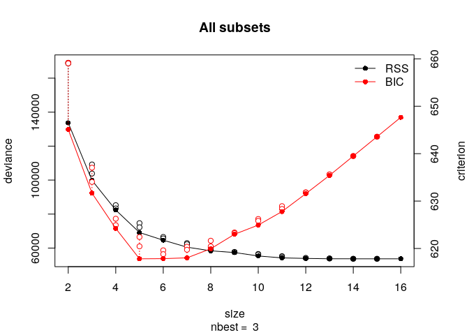
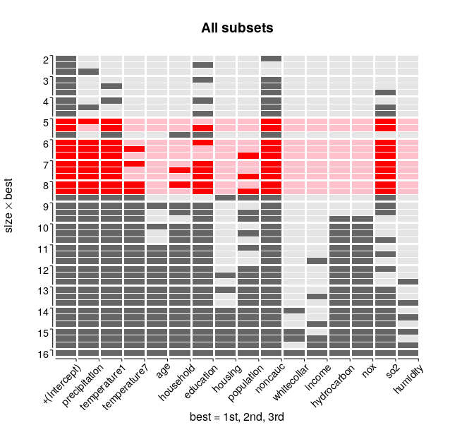
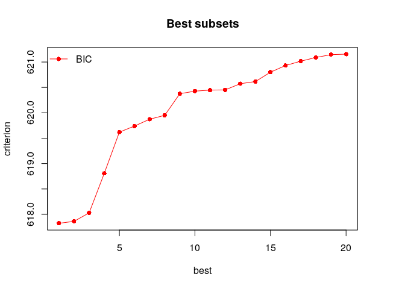
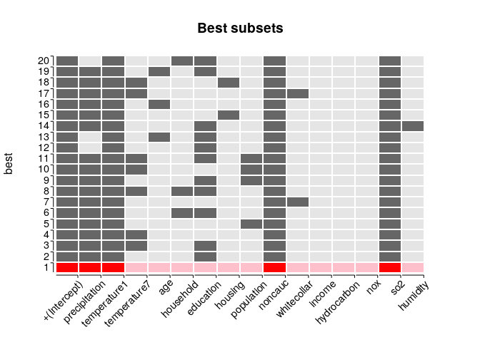

lmSubsets
=========

Overview
--------

Exact and approximation algorithms for variable-subset selection in
ordinary linear regression models. Either compute all submodels with the
lowest residual sum of squares, or determine the single-best submodel
according to a pre-determined statistical criterion. [Hofmann et al.
(2020)](http://dx.doi.org/10.18637/jss.v093.i03).

Installation
------------

    # Install package from CRAN:
    install.packages("lmSubsets")

Usage
-----

    # load package
    library("lmSubsets")

    # load some data
    data("AirPollution", package = "lmSubsets")

    head(AirPollution)

    ##   precipitation temperature1 temperature7  age household education housing
    ## 1            36           27           71  8.1      3.34      11.4    81.5
    ## 2            35           23           72 11.1      3.14      11.0    78.8
    ## 3            44           29           74 10.4      3.21       9.8    81.6
    ## 4            47           45           79  6.5      3.41      11.1    77.5
    ## 5            43           35           77  7.6      3.44       9.6    84.6
    ## 6            53           45           80  7.7      3.45      10.2    66.8
    ##   population noncauc whitecollar income hydrocarbon nox so2 humidity mortality
    ## 1       3243     8.8        42.6   11.7          21  15  59       59   921.870
    ## 2       4281     3.5        50.7   14.4           8  10  39       57   997.875
    ## 3       4260     0.8        39.4   12.4           6   6  33       54   962.354
    ## 4       3125    27.1        50.2   20.6          18   8  24       56   982.291
    ## 5       6441    24.4        43.7   14.3          43  38 206       55  1071.289
    ## 6       3325    38.5        43.1   25.5          30  32  72       54  1030.380

### All-subsets regression

    # compute 3 best submodels for every subset size
    lm_all <- lmSubsets(mortality ~ ., data = AirPollution, nbest = 3)
    lm_all

    ## Call:
    ##   lmSubsets(formula = mortality ~ ., data = AirPollution, nbest = 3)
    ## 
    ## Deviance:
    ##   [best, size (tolerance)] = RSS
    ##       2 (0)    3 (0)     4 (0)    5 (0)    6 (0)    7 (0)    8 (0)    9 (0)   
    ##   1st 133694.5  99841.07 82388.53 69154.11 64633.79 60538.76 58385.72 57379.21
    ##   2nd 168695.5 103859.31 83335.14 72250.33 65659.86 62288.70 58870.48 57617.43
    ##   3rd 169041.4 109202.60 85241.98 74666.42 66554.64 62953.77 60057.48 57748.66
    ##       10 (0)   11 (0)   12 (0)   13 (0)   14 (0)   15 (0)   16 (0)  
    ##   1st 55358.05 54221.58 53921.82 53712.66 53696.00 53683.31 53680.02
    ##   2nd 56185.55 54718.93 54146.37 53874.74 53696.65 53690.20         
    ##   3rd 56550.95 55260.67 54186.59 53900.78 53709.86 53695.48         
    ## 
    ## Subset:
    ##   [variable, best] = size
    ##                 1st       2nd          3rd             
    ##   +(Intercept)  2-16      2-15         2-15            
    ##   precipitation 5-16      4,6-15       2,6-15          
    ##   temperature1  4-16      3,5-15       5-15            
    ##   temperature7  7-16      6,8-15       8-15            
    ##   age           9-16      11-15        11-15           
    ##   household     8-16      7,9-15       5,10-15         
    ##   education     3-4,6-16  2,5,7-15     4-5,7,9-15      
    ##   housing       13-16     12,14-15     8,14-15         
    ##   population    11-16     8-10,12-15   6-9,12-15       
    ##   noncauc       2-16      3-15         3-15            
    ##   whitecollar   14-16     15                           
    ##   income        16        13,15        11,14-15        
    ##   hydrocarbon   10-16     10-15        9-15            
    ##   nox           10-16     10-15        9-15            
    ##   so2           5-9,12-16 4-9,11,13-15 3-4,6-8,10,13-15
    ##   humidity      15-16     14           12-13,15

    # plot deviances and BICs
    plot(lm_all)

    # plot heatmap, hilite 10 best submodels (BIC)
    image(lm_all, best = 1:3, hilite = 1:10, hilite_penalty = "BIC")

    # evaluate summary statistics
    summary(lm_all)

    ## Call:
    ##   lmSubsets(formula = mortality ~ ., data = AirPollution, nbest = 3)
    ## 
    ## Statistics:
    ##    SIZE BEST sigma    R2        R2adj     pval       Cp        AIC      BIC     
    ##     2   1    48.01123 0.4144106 0.4043142 2.8849e-08 53.585642 638.8107 645.0938
    ##         2    53.93092 0.2611043 0.2483647 3.0221e-05 82.274971 652.7630 659.0460
    ##         3    53.98617 0.2595895 0.2468238 3.2154e-05 82.558453 652.8859 659.1689
    ##     3   1    41.85209 0.5626906 0.5473464 5.7874e-11 27.836910 623.2920 631.6694
    ##         2    42.68598 0.5450905 0.5291288 1.7818e-10 31.130547 625.6595 634.0369
    ##         3    43.77025 0.5216866 0.5049037 7.4440e-10 35.510292 628.6696 637.0469
    ##     4   1    38.35653 0.6391337 0.6198016 1.9699e-12 15.531554 613.7640 624.2358
    ##         2    38.57626 0.6349875 0.6154333 2.7041e-12 16.307465 614.4495 624.9212
    ##         3    39.01510 0.6266355 0.6066338 5.0630e-12 17.870447 615.8069 626.2786
    ##     5   1    35.45910 0.6971012 0.6750722 1.0975e-13  6.683675 605.2575 617.8236
    ##         2    36.24421 0.6835396 0.6605243 3.5924e-13  9.221560 607.8855 620.4516
    ##         3    36.84523 0.6729570 0.6491721 8.7460e-13 11.201957 609.8591 622.4252
    ##     6   1    34.59656 0.7169005 0.6906875 1.1157e-13  4.978493 603.2015 617.8619
    ##         2    34.87009 0.7124062 0.6857771 1.6918e-13  5.819540 604.1465 618.8069
    ##         3    35.10688 0.7084870 0.6814951 2.4190e-13  6.552961 604.9587 619.6191
    ##     7   1    33.79705 0.7348369 0.7048185 1.1482e-13  3.621912 601.2743 618.0290
    ##         2    34.28204 0.7271721 0.6962859 2.3951e-13  5.056290 602.9841 619.7388
    ##         3    34.46458 0.7242590 0.6930431 3.1495e-13  5.601433 603.6213 620.3761
    ##     8   1    33.50824 0.7442674 0.7098418 2.4093e-13  3.857124 601.1015 619.9506
    ##         2    33.64706 0.7421441 0.7074327 2.9669e-13  4.254470 601.5977 620.4468
    ##         3    33.98458 0.7369449 0.7015337 4.9030e-13  5.227424 602.7954 621.6445
    ##     9   1    33.54225 0.7486759 0.7092525 7.6686e-13  5.032120 602.0582 623.0016
    ##         2    33.61181 0.7476325 0.7080454 8.4893e-13  5.227381 602.3068 623.2502
    ##         3    33.65006 0.7470577 0.7073805 8.9767e-13  5.334944 602.4433 623.3867
    ##    10   1    33.27403 0.7575287 0.7138839 1.4806e-12  5.375433 601.9066 624.9444
    ##         2    33.52180 0.7539042 0.7096070 2.1117e-12  6.053710 602.7968 625.8346
    ##         3    33.63063 0.7523037 0.7077184 2.4657e-12  6.353221 603.1858 626.2236
    ##    11   1    33.26504 0.7625065 0.7140385 3.9595e-12  6.443899 602.6620 627.7941
    ##         2    33.41725 0.7603281 0.7114155 4.8987e-12  6.851561 603.2098 628.3420
    ##         3    33.58227 0.7579552 0.7085584 6.1626e-12  7.295611 603.8010 628.9331
    ##    12   1    33.51673 0.7638195 0.7096948 1.4379e-11  8.198194 604.3294 631.5559
    ##         2    33.58645 0.7628359 0.7084858 1.5800e-11  8.382254 604.5787 631.8052
    ##         3    33.59892 0.7626598 0.7082693 1.6068e-11  8.415219 604.6233 631.8498
    ##    13   1    33.80566 0.7647356 0.7046681 5.1381e-11 10.026756 606.0962 635.4170
    ##         2    33.85663 0.7640257 0.7037769 5.4909e-11 10.159607 606.2770 635.5978
    ##         3    33.86481 0.7639116 0.7036338 5.5497e-11 10.180949 606.3060 635.6268
    ##    14   1    34.16584 0.7648086 0.6983414 1.8846e-10 12.013101 608.0776 639.4928
    ##         2    34.16604 0.7648057 0.6983378 1.8850e-10 12.013627 608.0783 639.4935
    ##         3    34.17025 0.7647479 0.6982636 1.8950e-10 12.024458 608.0931 639.5082
    ##    15   1    34.53929 0.7648641 0.6917108 6.5757e-10 14.002698 610.0634 643.5729
    ##         2    34.54150 0.7648340 0.6916712 6.5932e-10 14.008341 610.0711 643.5806
    ##         3    34.54320 0.7648108 0.6916409 6.6067e-10 14.012672 610.0770 643.5865
    ##    16   1    34.92851 0.7648786 0.6847235 2.1933e-09 16.000000 612.0597 647.6636

### Best-subset regression

    # compute 20 best (BIC) submodels
    lm_best <- lmSelect(mortality ~ ., data = AirPollution, nbest = 20)
    lm_best

    ## Call:
    ##   lmSelect(formula = mortality ~ ., data = AirPollution, nbest = 20)
    ## 
    ## Criterion:
    ##   [best] = BIC
    ##        1st      2nd      3rd      4th      5th      6th      7th      8th 
    ##   617.8236 617.8619 618.0290 618.8069 619.6191 619.7388 619.8733 619.9506 
    ##        9th     10th     11th     12th     13th     14th     15th     16th 
    ##   620.3761 620.4269 620.4468 620.4516 620.5732 620.6156 620.8005 620.9322 
    ##       17th     18th     19th     20th 
    ##   621.0169 621.0900 621.1458 621.1550 
    ## 
    ## Subset:
    ##                 best                 
    ##   +(Intercept)  1-20                 
    ##   precipitation 1-11,14-19           
    ##   temperature1  1-20                 
    ##   temperature7  3-4,8,10-11,17-18    
    ##   age           13,16,19             
    ##   household     6,8,20               
    ##   education     2-3,6,8-9,11-14,19-20
    ##   housing       15,18                
    ##   population    5,9-11               
    ##   noncauc       1-20                 
    ##   whitecollar   7,17                 
    ##   income                             
    ##   hydrocarbon                        
    ##   nox                                
    ##   so2           1-20                 
    ##   humidity      14

    # plot deviances and BIC
    plot(lm_best)

    # show heatmap
    image(lm_best, hilite = 1)

    # evaluate summary statistics
    summary(lm_best)

    ## Call:
    ##   lmSelect(formula = mortality ~ ., data = AirPollution, nbest = 20)
    ## 
    ## Statistics:
    ##    SIZE BEST sigma    R2        R2adj     pval       Cp       AIC      BIC     
    ##    5     1   35.45910 0.6971012 0.6750722 1.0975e-13 6.683675 605.2575 617.8236
    ##    6     2   34.59656 0.7169005 0.6906875 1.1157e-13 4.978493 603.2015 617.8619
    ##    7     3   33.79705 0.7348369 0.7048185 1.1482e-13 3.621912 601.2743 618.0290
    ##    6     4   34.87009 0.7124062 0.6857771 1.6918e-13 5.819540 604.1465 618.8069
    ##    6     5   35.10688 0.7084870 0.6814951 2.4190e-13 6.552961 604.9587 619.6191
    ##    7     6   34.28204 0.7271721 0.6962859 2.3951e-13 5.056290 602.9841 619.7388
    ##    6     7   35.18135 0.7072491 0.6801425 2.7055e-13 6.784624 605.2129 619.8733
    ##    8     8   33.50824 0.7442674 0.7098418 2.4093e-13 3.857124 601.1015 619.9506
    ##    7     9   34.46458 0.7242590 0.6930431 3.1495e-13 5.601433 603.6213 620.3761
    ##    7    10   34.47918 0.7240254 0.6927829 3.2190e-13 5.645161 603.6721 620.4269
    ##    8    11   33.64706 0.7421441 0.7074327 2.9669e-13 4.254470 601.5977 620.4468
    ##    5    12   36.24421 0.6835396 0.6605243 3.5924e-13 9.221560 607.8855 620.4516
    ##    6    13   35.38715 0.7038141 0.6763895 3.6815e-13 7.427446 605.9128 620.5732
    ##    7    14   34.53343 0.7231562 0.6918154 3.4908e-13 5.807818 603.8608 620.6156
    ##    6    15   35.45422 0.7026903 0.6751616 4.0686e-13 7.637752 606.1401 620.8005
    ##    6    16   35.49316 0.7020369 0.6744477 4.3113e-13 7.760027 606.2718 620.9322
    ##    7    17   34.64911 0.7212983 0.6897472 4.1474e-13 6.155493 604.2621 621.0169
    ##    7    18   34.67023 0.7209585 0.6893689 4.2797e-13 6.219089 604.3352 621.0900
    ##    7    19   34.68636 0.7206987 0.6890797 4.3835e-13 6.267703 604.3911 621.1458
    ##    6    20   35.55912 0.7009283 0.6732365 4.7553e-13 7.967486 606.4946 621.1550

Authors
-------

Marc Hofmann (maintainer), Cristian Gatu, Erricos J. Kontoghiorghes, Ana
Colubi, Achim Zeileis
